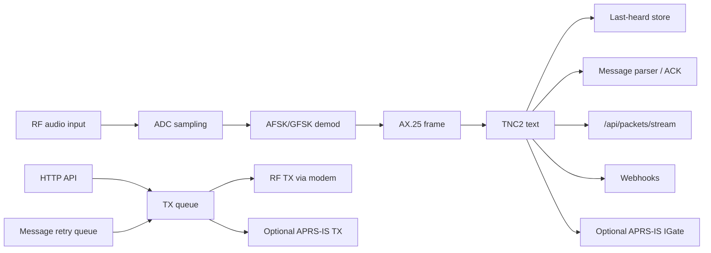

# ESP32APRS Audio Architecture Notes for a Rust Rewrite

This document describes how the current firmware is built at the hardware,
radio, modem, and API/backend layers. It is intended as a rewrite reference,
not as an end-user manual. The frontend is mentioned only where it affects
firmware API contracts or embedded asset handling.

## Current Build Shape

The project is an Arduino/PlatformIO ESP32 firmware with local libraries under
`lib/` and the main firmware in `src/`.

The default PlatformIO environment is `kv4p-ht`:

| Item | Current value |
| --- | --- |
| Board | `esp32doit-devkit-v1` |
| Partition table | `flash_NOOTA.csv` |
| Important flags | `KV4P_HT`, `STRIP_PIN=13`, `RFMODULE`, `ENABLE_FX25` |
| Framework | Arduino on Espressif32 |
| Upload path | USB flashing through PlatformIO, usually via `deploy.sh` |

The `flash_NOOTA.csv` partition is used because the application is too large
for the smaller OTA partition layout after webhooks, HTTP client, TLS, and the
embedded web UI are linked in.

Build-time generated files:

| File | Source | Purpose |
| --- | --- | --- |
| `include/build_info.h` | `scripts/pio_gen_build_info.py` -> `scripts/gen_build_info.py` | Build date, time, git commit, dirty state, and version metadata |
| `include/embedded_ui.h` | `scripts/embed_ui.py` from `data/index.html`, `data/app.js`, `data/app.css`, manifest | Gzipped embedded web UI served directly from flash |

Important operational detail: the web UI embed step is not currently a normal
PlatformIO pre-build hook. After changing files under `data/`, regenerate
`include/embedded_ui.h` before flashing or the ESP32 will serve the old UI.

## Hardware Model

The firmware is built around three physical paths:

1. RF module control over a UART-like AT command interface.
2. RX audio from radio speaker/discriminator into an ESP32 ADC pin.
3. TX audio from ESP32 DAC/PWM output into the radio microphone/audio input,
   with a GPIO-controlled PTT line.

For the `KV4P_HT` target, `defaultConfig()` and the setup-time pin fix force
the radio-facing pins to this map:

| Function | GPIO | Active level | Notes |
| --- | ---: | --- | --- |
| RF module UART TX | 17 | n/a | ESP32 TX into RF module RX |
| RF module UART RX | 16 | n/a | ESP32 RX from RF module TX |
| RF squelch / SQL | 4 | Low | Used as carrier/squelch input by the modem layer |
| RF power-down / PD | 19 | High | Enables/wakes the RF module |
| RF PTT | 18 | Low | Open-drain style behavior when active-low |
| RF power GPIO | -1 | n/a | Not used on this target |
| ADC input | 34 | n/a | RX audio input |
| DAC output | 25 | n/a | TX audio output for KV4P-HT |
| NeoPixel strip | 13 | n/a | Status indicator |

The default `KV4P_HT` RF configuration enables the RF module and sets both RX
and TX frequency to `144.8000` MHz. Generic defaults use `144.3900` MHz and RF
disabled.

## RF Module Control

The RF module is configured in `RF_MODULE(bool boot)` in `src/main.cpp`.
Supported module families are defined as integer RF types:

| Type | Meaning |
| ---: | --- |
| 0 | No RF module |
| 1 | SA818/SA868 VHF, 134-174 MHz |
| 2 | SA818/SA868 UHF, 400-470 MHz |
| 3 | SA818/SA868 350 MHz, 320-400 MHz |
| 4-8 | SR/FRS VHF, UHF, 350 MHz variants |

The module is controlled with AT commands over `SerialRF`, currently
`EspSoftwareSerial`, using `config.rf_baudrate`.

Initialization flow:

1. Stop audio sampling/output by setting `adcEn = -1` and `dacEn = -1`.
2. Configure power, PD, PTT, and SQL GPIOs.
3. Start `SerialRF` on the configured RX/TX pins when booting.
4. Assert power/PD according to active levels.
5. Probe and configure the module with AT commands.
6. Restore ADC sampling by setting `adcEn = 1`.

SA868-style modules use commands such as:

```text
AT+DMOCONNECT
AT+VERSION
AT+DMOSETGROUP=<band>,<tx_freq>,<rx_freq>,<tx_tone>,<squelch>,<rx_tone>
AT+SETTAIL=0
AT+SETFILTER=1,1,1
AT+DMOSETVOLUME=<volume>
```

SR/FRS-style modules use related commands such as `AT+DMOSETGROUP`,
`AT+DMOAUTOPOWCONTR`, `AT+DMOSETVOX`, `AT+DMOSETMIC`, and `AT+DMOVOL`.

For a Rust rewrite, this should become a small radio-driver trait with separate
implementations for SA868 and SR/FRS command sets. The rest of the system
should not know AT command strings.

## Audio and Modem Layer

The APRS modem lives mostly in `lib/LibAPRS_ESP32/`. The firmware calls into it
from `taskAPRSPoll()`:

```cpp
afskSetModem(config.modem_type, config.audio_lpf,
             config.tx_timeslot, config.preamble * 100,
             config.fx25_mode);
afskSetSQL(config.rf_sql_gpio, config.rf_sql_active);
afskSetPTT(config.rf_ptt_gpio, config.rf_ptt_active);
afskSetPWR(config.rf_pwr_gpio, config.rf_pwr_active);
afskSetADCAtten(config.adc_atten);
AFSK_init(config.adc_gpio, config.dac_gpio, config.rf_ptt_gpio,
          config.rf_sql_gpio, config.rf_pwr_gpio, ...);
```

Modem IDs used by the API and config:

| ID | Mode |
| ---: | --- |
| 0 | 300 baud Bell 103 |
| 1 | 1200 baud Bell 202 |
| 2 | 1200 baud V.23 |
| 3 | 9600 baud G3RUH |

Sample-rate behavior in `afskSetModem()`:

| Mode | Classic ESP32 RX sample rate | Block size | Resample target |
| --- | ---: | ---: | ---: |
| 300 baud | 19200 Hz | 384 | 9600 Hz |
| 1200 Bell 202 | 28800 Hz | 576 | 9600 Hz |
| 1200 V.23 | 28800 Hz | 576 | 9600 Hz |
| 9600 G3RUH | 38400 Hz | 384 | 38400 Hz |

The TX DAC timer uses `CONFIG_AFSK_DAC_SAMPLERATE = 38400`. Preamble is stored
as a small integer in config and passed to the modem as `config.preamble * 100`.
The default preamble is `3`, so the modem sees `300`.

The modem controls PTT, power, DAC timing, and ADC timing. The main APRS task
does deferred start/stop by watching global flags:

| Flag | Meaning |
| --- | --- |
| `adcEn = 1` | Start ADC sampling timer |
| `adcEn = -1` | Stop ADC sampling timer |
| `dacEn = 1` | Start DAC timer |
| `dacEn = -1` | Stop DAC timer |
| `pttOff = true` | Release PTT outside ISR context |

The ISR path must stay small. Current code intentionally releases PTT from the
main APRS task because status LED updates and NeoPixel writes are not ISR-safe.

Rust rewrite implication: keep the audio ISR/timer boundary explicit. PTT state
changes, LED updates, and packet bookkeeping should be driven by task messages,
not by direct ISR side effects.

## Runtime Tasks

The firmware creates three main FreeRTOS tasks after config, LittleFS, RF, and
webhook initialization:

| Task | Role |
| --- | --- |
| `taskAPRS` | Main APRS state machine: RX frame processing, TX queue drain, IGate, digi, tracker, telemetry, message retry/ACK handling |
| `taskAPRSPoll` | Low-latency modem poll loop. Calls `AFSK_Poll()` every 1-3 ms depending on modem |
| `taskNetwork` | WiFi, APRS-IS, web server, MQTT, time, and network maintenance |

High-level packet flow:



## RX Packet Handling

RX audio is decoded by LibAPRS/AX.25 into an `AX25Msg`. The firmware converts
that frame to TNC2 text with `packet2Raw()`:

```text
SRC[-SSID]>DST[-SSID],PATH*:INFO
```

The packet then flows through:

1. `publishRawPacket(raw, channel, audio_level)` for the new UI SSE stream.
2. `pkgListUpdate(...)` for the current last-heard/callsign-keyed list.
3. `handleIncomingAPRS(tnc2)` for APRS message parsing and ACK generation.
4. Optional IGate, digi, tracker, telemetry, and webhook processing.

Important current limitation: `pkgList` is keyed by callsign/object rather than
being a chronological packet log. That is suitable for last-heard views but bad
as the only source for chat history because later packets from the same station
replace earlier ones. The browser also stores packets in IndexedDB, so browser
history and firmware history are currently two different concepts.

For the Rust rewrite, use two stores:

| Store | Purpose | Recommended shape |
| --- | --- | --- |
| Chronological RX ring | Browser hydration, chat, debugging | Fixed-size ring of recent packet events |
| Last-heard index | Dashboard/current station state | Map keyed by station/object |

## TX Packet Handling

TX packets are queued with `pkgTxPush(info, len, delay, channel_mask)`.
`txQueueType` contains:

| Field | Meaning |
| --- | --- |
| `Active` | Queue slot in use |
| `Channel` | Bitmask of RF, APRS-IS, and/or TNC channel |
| `timeStamp` | Queue insertion / scheduling time |
| `Delay` | Delay before sending |
| `length` | TNC2 string length |
| `Info[350]` | TNC2 packet text |

Channel bitmask values:

| Bit | Meaning |
| ---: | --- |
| `1 << 0` | RF channel |
| `1 << 1` | APRS-IS internet channel |
| `1 << 2` | TNC channel |

`pkgTxSend()` drains active slots:

1. If APRS-IS is enabled and connected, write TNC2 plus CRLF to the APRS-IS
   socket and clear the internet bit.
2. If RF is enabled, configure preamble, call `APRS_sendTNC2Pkt()`, increment
   TX telemetry counters, and clear the RF bit.
3. Clear the queue entry when all channel bits are done or the entry is older
   than 60 seconds.

Messages use a separate retry/status queue in `src/message.cpp`. The API sends
messages with `sendAPRSMessage()`, which formats:

```text
SRC>APE32L[,PATH]::TOCALL   :MESSAGE{ID
```

Numbered inbound APRS messages addressed to the local callsign are
automatically acknowledged with:

```text
SRC>APE32L[,PATH]::TOCALL   :ackNN
```

The current code now builds TX source callsigns with SSID preserved. A Rust
rewrite should make `Callsign { base, ssid }` a real type and avoid passing
partially formatted strings around.

## Backend API Surface

The new mobile/chat UI consumes a small `/api/*` surface from
`src/webservice.cpp`. The older configuration pages still exist as HTML routes
such as `/radio`, `/igate`, `/digi`, `/tracker`, `/wx`, `/system`, and others.

Core API endpoints:

| Method | Path | Purpose |
| --- | --- | --- |
| `GET` | `/healthz` | Minimal health check with uptime and heap stats |
| `GET` | `/api/me` | Identity, version, IP, heap, uptime, RX/TX counters |
| `GET` | `/api/version` | Build metadata from `include/build_info.h` |
| `GET` | `/api/radio` | Current RF/modem/audio settings |
| `POST` | `/api/radio` | Update RF/modem settings and request RF reinit when needed |
| `POST` | `/api/identity` | Update callsign and SSID consistently across APRS roles |
| `POST` | `/api/time` | Browser-assisted Unix UTC clock sync |
| `GET` | `/api/packets/recent` | Recent packets for UI hydration |
| `GET` | `/api/packets/stream` | Server-sent events stream of live packet events |
| `POST` | `/api/tx/message` | Send APRS message, optional path |
| `GET` | `/api/messages/pending` | Outbound message retry/ACK/failure status |
| `POST` | `/api/tx/position` | Send APRS position packet |
| `GET` | `/api/webhooks` | List webhook slots |
| `POST` | `/api/webhooks` | Update webhook slot |
| `POST` | `/api/webhooks/test` | Fire a test webhook event |

Compatibility rules for a Rust backend:

1. Keep the same paths and HTTP methods.
2. Keep `application/x-www-form-urlencoded` request bodies for POST endpoints.
3. Return `application/json` for `/api/*` responses.
4. Use the same field names and primitive types. The browser code depends on
   these names directly.
5. Add new fields only in a backward-compatible way. Do not remove or rename
   existing fields.
6. Use `Cache-Control: no-cache` on state endpoints and embedded app assets
   during development so the browser does not use stale firmware/UI state.

Common success response for simple mutating endpoints:

```json
{"ok": true}
```

Common error response shape:

```json
{"ok": false, "err": "missing field"}
```

Typical error status codes:

| Status | Meaning |
| ---: | --- |
| 400 | Missing, empty, or invalid request fields |
| 500 | Configuration save or allocation failure |
| 503 | Valid request, but the device could not queue or perform the operation |

### API Response Examples

#### `GET /healthz`

Response:

```json
{
  "ok": true,
  "uptime": 3600,
  "free_heap": 123456,
  "min_free_heap": 98240,
  "largest_free_block": 65536
}
```

#### `GET /api/version`

Response:

```json
{
  "commit": "65b6c5d",
  "commit_full": "65b6c5dab19c598e54544b9cba287162e518e46c",
  "branch": "master",
  "build_time": "2026-05-11 10:44:12",
  "version": "1.7"
}
```

The UI uses this to detect stale browser assets. Keep both short and full
commit fields.

#### `GET /api/me`

Response:

```json
{
  "callsign": "M7JVI",
  "ssid": 1,
  "version": "1.7",
  "ip": "10.66.3.171",
  "free_heap": 117640,
  "uptime": 540,
  "rx_count": 12,
  "tx_count": 3
}
```

Required fields:

| Field | Type | Notes |
| --- | --- | --- |
| `callsign` | string | Base APRS callsign without SSID suffix |
| `ssid` | number | APRS SSID, `0`-`15` |
| `version` | string | Firmware version string |
| `ip` | string | Current station IP |
| `free_heap` | number | Current heap bytes |
| `uptime` | number | Seconds since boot |
| `rx_count` | number | RX packets published since boot |
| `tx_count` | number | TX packets accepted since boot |

#### `GET /api/radio`

Response:

```json
{
  "freq_rx": 144.8000,
  "freq_tx": 144.8000,
  "tone_rx": 0,
  "tone_tx": 0,
  "sql_level": 1,
  "rf_power": false,
  "band": 0,
  "rf_en": true,
  "volume": 6,
  "rf_type": 1,
  "modem": 1,
  "adc_en": 1,
  "sql_active": 0,
  "mvrms": 370,
  "sql_pin": 1,
  "dcd": 0,
  "fx25_mode": 0,
  "audio_lpf": true,
  "preamble": 3,
  "tx_timeslot": 2000
}
```

Compatibility notes:

| Field | Type | Notes |
| --- | --- | --- |
| `freq_rx`, `freq_tx` | number | MHz, four decimals preferred |
| `tone_rx`, `tone_tx` | number | CTCSS values in current firmware convention |
| `sql_level` | number | RF module squelch level |
| `rf_power` | boolean | `false` low, `true` high |
| `band` | number | RF band enum |
| `rf_en` | boolean | RF enabled |
| `volume` | number | RF module volume |
| `rf_type` | number | RF module enum |
| `modem` | number | `0` 300, `1` Bell 202, `2` V.23, `3` G3RUH |
| `adc_en` | number | `1` sampling, `-1` halted, `0` neutral |
| `sql_active` | number | Configured SQL active level |
| `mvrms` | number | Current input RMS in mV |
| `sql_pin` | number | Current SQL GPIO read or `-1` |
| `dcd` | number | Demodulator carrier-detect counter |
| `fx25_mode` | number | `0` off, `1` RX, `2` RX+TX |
| `audio_lpf` | boolean | Current audio filter flag |
| `preamble` | number | UI value, internally multiplied by `100` |
| `tx_timeslot` | number | TX timeslot in milliseconds |

#### `POST /api/radio`

Request content type:

```http
Content-Type: application/x-www-form-urlencoded
```

Example request body:

```text
freq_rx=144.8000&freq_tx=144.8000&rf_en=1&modem_type=1&preamble=3&tx_timeslot=2000
```

Accepted form fields:

| Field | Required | Notes |
| --- | --- | --- |
| `freq` | no | MHz, sets RX and TX together |
| `freq_rx` | no | MHz |
| `freq_tx` | no | MHz |
| `tone_rx` | no | integer |
| `tone_tx` | no | integer |
| `sql_level` | no | integer |
| `volume` | no | integer |
| `rf_power` | no | truthy values start with `1`, `t`, `y`, or `h` |
| `rf_en` | no | truthy values start with `1`, `t`, or `y` |
| `modem_type` | no | `0`-`3` |
| `fx25_mode` | no | `0`-`2` |
| `preamble` | no | `1`-`20` |
| `audio_lpf` | no | truthy values start with `1`, `t`, or `y` |
| `tx_timeslot` | no | `0`-`60000` milliseconds |

Success response:

```json
{
  "ok": true,
  "freq_rx": 144.8000,
  "freq_tx": 144.8000,
  "tone_rx": 0,
  "tone_tx": 0,
  "sql_level": 1,
  "rf_power": false
}
```

No recognized fields:

```json
{"ok": false, "err": "no fields"}
```

#### `POST /api/identity`

Example request body:

```text
callsign=M7JVI&ssid=1
```

Success response:

```json
{
  "ok": true,
  "callsign": "M7JVI",
  "ssid": 1
}
```

Validation behavior:

| Field | Behavior |
| --- | --- |
| `callsign` | Uppercase, strip whitespace, keep only `A-Z`, `0-9`, and `-` |
| `ssid` | Clamp to `0`-`15` |

Error examples:

```json
{"ok": false, "err": "no fields"}
```

```json
{"ok": false, "err": "empty callsign"}
```

#### `POST /api/time`

The browser calls this automatically so the ESP32 can timestamp packets even
without NTP.

Example request body:

```text
epoch=1778513198&tz=1
```

Success response:

```json
{
  "ok": true,
  "epoch": 1778513198,
  "timeZone": 1.00
}
```

Error examples:

```json
{"ok": false, "err": "missing epoch"}
```

```json
{"ok": false, "err": "bad epoch"}
```

#### `GET /api/packets/recent`

Purpose: hydrate a browser after reload. Current firmware sources this from a
callsign-keyed last-heard list, newest first. A Rust implementation should keep
this endpoint compatible but may back it with a true chronological ring.

Response:

```json
[
  {
    "ts": 1778513198,
    "ch": 0,
    "audio": 364,
    "raw": "M0PZH-1>APE32L,RFONLY::M7JVI-1  :hi{"
  },
  {
    "ts": 1778513140,
    "ch": 1,
    "audio": 0,
    "raw": "M7JVI-1>APE32L,WIDE1-0,WIDE2-1:!5128.62N/00007.20W>hello"
  }
]
```

Required packet fields:

| Field | Type | Notes |
| --- | --- | --- |
| `ts` | number | Unix timestamp in seconds |
| `ch` | number | Firmware channel indicator |
| `audio` | number | Raw audio level, not formatted dBV text |
| `raw` | string | TNC2 packet line |

#### `GET /api/packets/stream`

`/api/packets/stream` is an EventSource/SSE endpoint. It sends `packet` events.
The JSON event payload must look like:

```json
{
  "ts": 1778513198,
  "ch": 0,
  "audio": 364,
  "dir": "rx",
  "raw": "M0PZH-1>APE32L,RFONLY::M7JVI-1  :hi{"
}
```

The SSE wire format must be compatible with browser `EventSource`:

```text
event: packet
id: 540
retry: 1000
data: {"ts":1778513198,"ch":0,"audio":364,"dir":"rx","raw":"M0PZH-1>APE32L,RFONLY::M7JVI-1  :hi{"}

```

`dir` must be either `rx` or `tx`. Self-transmitted messages and positions are
echoed to this stream with `dir: "tx"` so the chat UI can render them
immediately.

#### `POST /api/tx/message`

Example request body:

```text
to=M0PZH-1&text=hi&path=RFONLY-0
```

Accepted form fields:

| Field | Required | Notes |
| --- | --- | --- |
| `to` | yes | Destination callsign, with optional SSID |
| `text` | yes | Message text, current buffer stores up to 199 bytes |
| `path` | no | APRS path; current sanitizer keeps `A-Z`, `0-9`, `-`, and `,` |

Success response:

```json
{
  "ok": true,
  "msgID": 42
}
```

Error examples:

```json
{"ok": false, "err": "missing to"}
```

```json
{"ok": false, "err": "missing text"}
```

Side effects that the UI expects:

1. Increment `tx_count`.
2. Add the outbound message to pending message state.
3. Echo a representative TX packet to `/api/packets/stream`.

#### `GET /api/messages/pending`

Purpose: let the chat UI mark local message bubbles as pending, acked, or
failed.

Response:

```json
[
  {
    "msgID": 42,
    "to": "M0PZH-1",
    "text": "hi",
    "path": "RFONLY-0",
    "ack": 3,
    "status": "pending",
    "ts": 1778513198,
    "age_s": 8,
    "retries_left": 3,
    "retries_total": 5
  },
  {
    "msgID": 41,
    "to": "M0PZH-1",
    "text": "previous",
    "path": "WIDE1-0,WIDE2-1",
    "ack": -2,
    "status": "acked",
    "ts": 1778513000,
    "age_s": 206,
    "retries_left": 0,
    "retries_total": 5
  }
]
```

Status mapping:

| `ack` value | `status` | Meaning |
| ---: | --- | --- |
| `> 0` | `pending` | Retries remain |
| `0` | `failed` | Retries exhausted |
| `-2` | `acked` | Recipient ACK received |

#### `POST /api/tx/position`

Example request body:

```text
lat=51.4779&lon=-0.0015&comment=hello&path=WIDE1-0,WIDE2-1&symbol_table=/&symbol_code=>
```

Accepted form fields:

| Field | Required | Notes |
| --- | --- | --- |
| `lat` | yes | Decimal latitude |
| `lon` | yes | Decimal longitude |
| `comment` | no | Current buffer stores up to 63 bytes |
| `path` | no | Sanitized APRS path, default current firmware value is `WIDE1-1` |
| `symbol_table` | no | One character, default `/` |
| `symbol_code` | no | One character, default `>` |
| `dest` | no | `rf`, `inet`, or blank for tracker-config-derived default |

Success response:

```json
{
  "ok": true,
  "raw": "(see /api/packets/stream)"
}
```

Queue failure response:

```json
{
  "ok": false,
  "raw": "(see /api/packets/stream)"
}
```

Validation error examples:

```json
{"ok": false, "err": "missing lat/lon"}
```

```json
{"ok": false, "err": "bad lat/lon"}
```

#### `GET /api/webhooks`

Response:

```json
[
  {
    "slot": 0,
    "enabled": true,
    "event_mask": 1,
    "name": "telegram",
    "url": "https://example.invalid/hook",
    "body_template": "{\"text\":\"{src}: {message}\"}",
    "filter_callsign": ""
  }
]
```

#### `POST /api/webhooks`

Example request body:

```text
slot=0&enabled=1&event_mask=1&name=telegram&url=https%3A%2F%2Fexample.invalid%2Fhook&body_template=%7B%22text%22%3A%22%7Bsrc%7D%3A%20%7Bmessage%7D%22%7D
```

Success response:

```json
{"ok": true}
```

#### `POST /api/webhooks/test`

Example request body:

```text
slot=0
```

Queued response:

```json
{
  "ok": true,
  "queued": true,
  "err": "queued"
}
```

## Audio WebSocket

The firmware registers an audio WebSocket at:

```text
ws://<device-ip>/ws_audio
```

Server-to-client text frame on connect:

```json
{
  "type": "cfg",
  "codec": "mulaw",
  "rate": 8000,
  "tx": 144.8000,
  "rx": 144.8000
}
```

Implemented wire contract:

| Direction | Format |
| --- | --- |
| ESP32 to browser binary | 8 kHz mono G.711 mu-law audio |
| Browser to ESP32 binary | 8 kHz mono G.711 mu-law audio, accepted while the client owns TX |
| Browser to ESP32 text | `ping`, `tx_start`, `tx_stop`, `set_freq:<tx>,<rx>` |
| ESP32 to browser text | JSON status/config frames, plus `pong` for `ping` |

Text command responses:

| Command | Success response |
| --- | --- |
| `ping` | `pong` |
| `tx_start` | `{"type":"tx","ok":1,"state":"on"}` |
| `tx_stop` | `{"type":"tx","ok":1,"state":"off"}` |
| `set_freq:144.8000,144.8000` | `{"type":"freq","ok":1,"tx":144.8000,"rx":144.8000}` |

Possible `tx_start` failure responses:

```json
{"type":"tx","ok":0,"reason":"rf_disabled"}
```

```json
{"type":"tx","ok":0,"reason":"busy"}
```

```json
{"type":"tx","ok":0,"reason":"modem_busy"}
```

The browser is responsible for sample-rate conversion, AGC, VAD, and converting
between WebAudio float samples and mu-law bytes. Firmware-side playback drains
a small ring buffer and writes DAC samples on a timer.

## Storage and Configuration

Configuration is a single large `Configuration` struct in `include/config.h`
persisted to LittleFS, mainly as `/default.cfg`.

Major config groups:

| Group | Examples |
| --- | --- |
| WiFi/network | AP/STA mode, credentials, hostname, VPN, MQTT |
| APRS identity | Callsign, SSID, APRS-IS settings |
| RF module | Type, RX/TX frequency, tones, squelch, volume, power |
| Audio/modem | ADC/DAC GPIOs, ADC attenuation, modem type, FX.25, preamble, timeslot |
| IGate/digi | Enable flags, filters, beacon/status intervals |
| Messaging | Message callsign, encryption flag, retry state |
| Tracker/GNSS | GPS ports, intervals, symbol, path |
| Weather/telemetry | Sensor definitions, telemetry coefficients and labels |
| Webhooks | URL, template, filters, enabled mask |

For Rust, split this into versioned sub-config structs and persist with a
schema version. This will make migration and defaults safer than the current
monolithic struct plus scattered setup-time corrections.

## Current Backend Constraints to Preserve or Fix

Things worth preserving:

| Area | Current behavior to keep |
| --- | --- |
| Embedded UI | Serve precompressed static assets directly from flash without building huge heap strings |
| API cache headers | API and app assets should avoid stale browser state during development |
| RF reinit | Radio setting changes should defer RF-module reinitialization outside request handlers |
| PTT release | PTT/LED side effects should happen outside ISR context |
| Bounded queues | TX, RX, webhook, and audio buffers must remain bounded |

Things to fix in the rewrite:

| Area | Problem in current design |
| --- | --- |
| Packet history | Callsign-keyed `pkgList` is not enough for chat/history |
| Identity handling | Callsign and SSID are often passed as formatted strings |
| API consistency | Some old routes return large generated HTML, new routes return JSON |
| UI embed | Static asset generation is manual rather than part of the normal build |
| Memory ownership | Many paths depend on global state and manual buffers |
| Testability | APRS parsing, ACK handling, position formatting, and RF path parsing need fixture tests |

## Suggested Rust Module Split

One practical Rust rewrite structure:

| Module | Responsibility |
| --- | --- |
| `hal` | GPIO, ADC, DAC/timer, UART, WiFi/time primitives |
| `radio` | RF module trait plus SA868/SR command drivers |
| `audio` | Sample buffers, ADC/DAC scheduling, monitor WebSocket bridge |
| `modem` | AFSK/GFSK/FX.25 encode and decode boundary |
| `ax25` | AX.25 frame encode/decode and TNC2 conversion |
| `aprs` | APRS message, position, path, ACK, object, telemetry formatting/parsing |
| `tx_queue` | Bounded scheduled TX queue with RF/APRS-IS channel masks |
| `rx_store` | Chronological packet ring plus last-heard index |
| `api` | HTTP routes, JSON models, SSE, WebSocket |
| `storage` | Versioned config load/save and migrations |
| `webhooks` | Async outbound event worker with bounded retry/backpressure |

Recommended internal event model:

```text
RF/audio ISR -> modem task -> decoded packet event -> APRS/router task
HTTP API -> command event -> TX/message task -> RF/APRS-IS sink
state changes -> SSE/API snapshot stores
```

Do not let HTTP handlers directly manipulate radio timing or global modem
state. They should validate input and enqueue commands.

## Rewrite Test Fixtures

Minimum tests before replacing the firmware behavior:

| Test area | Examples |
| --- | --- |
| TNC2 parsing | Source/destination SSID, paths with `*`, empty path, malformed packets |
| APRS messages | Numbered messages, ACKs, duplicate collapse, messages from unrelated stations |
| Position packets | Uncompressed lat/lon encode/decode, symbol table/code, comments |
| Paths | `RFONLY-0`, `WIDE1-0,WIDE2-1`, empty path, invalid characters |
| TX source identity | Callsign with and without SSID, no duplicate `-SSID` |
| RF config | Frequency/tones/squelch converted to exact AT commands |
| API | JSON shapes for `/api/me`, `/api/radio`, `/api/packets/recent`, SSE events |
| Timing | Preamble units, timeslot behavior, PTT assert/release order |

The highest-risk rewrite areas are modem timing, PTT/DAC sequencing, and packet
history semantics. Preserve those with hardware traces and fixture tests before
replacing the current C++ implementation.
